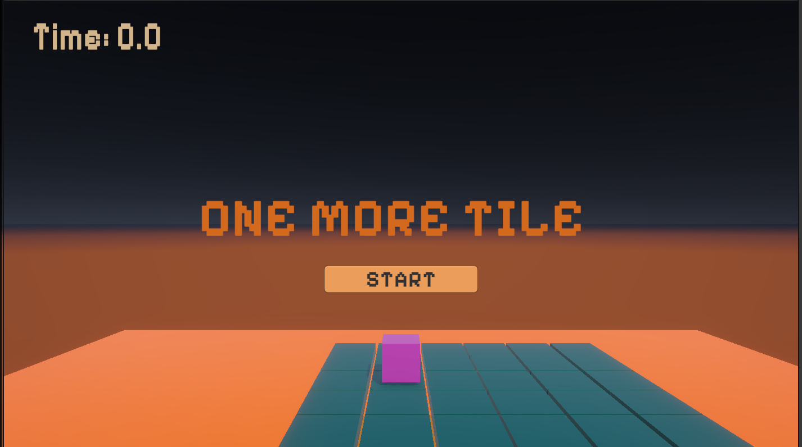
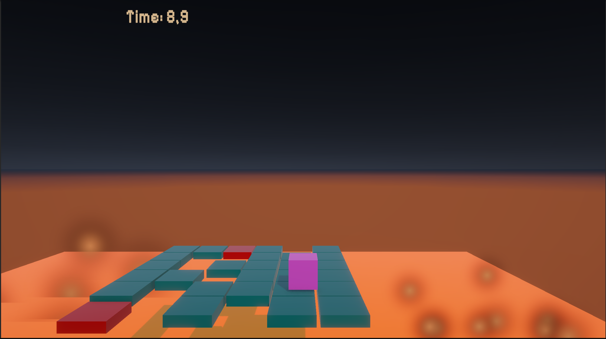
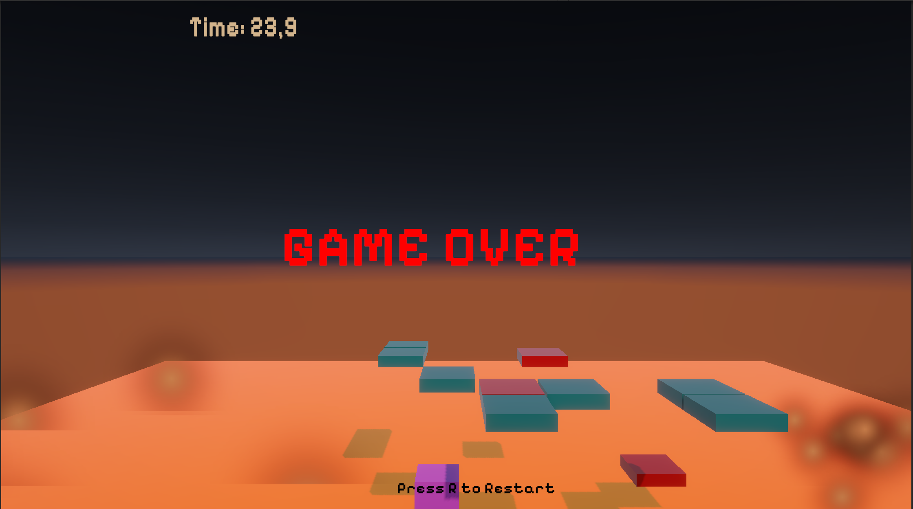

# 🎮 One More Tile

My first 3D game built with Unity.

This project is a small experimental prototype where I explored core gameplay mechanics, player movement, and basic game feel in a 3D environment.

---

## 🧠 What I learned

This project represents my first step into 3D game development.  
While building it, I learned:

- How to control a player using a CharacterController
- Basic 3D movement and gravity handling
- Collision detection and physics interactions
- Trigger events (OnTriggerEnter) for gameplay logic
- Managing game states (start, lose condition)
- Integrating audio feedback (click, impact, lose)
- Structuring a simple Unity project

Most importantly, I started understanding how **game feel** changes the player experience.

---

## 🎮 How it works

The goal of the game is simple:

> Stay alive as long as possible while tiles fall around you.

### Mechanics:
- The player can move around the platform
- Tiles fall and create obstacles
- If the player falls → game over
- The game progressively becomes harder

### Controls:
- **WASD / Arrow Keys** → Move
- **Mouse** → Camera (if implemented)
- **Click** → Start game

---

## 🔊 Features

- Basic 3D movement system
- Falling tiles mechanic
- Game over system
- Sound effects:
  - Click (start)
  - Impact (tiles)
  - Lose (game over)

---

## 🚀 Why I made this

I built this project to:
- move from 2D to 3D development
- understand Unity’s 3D systems
- start creating complete, playable experiences

This is my first step in my journey as a game developer.

---

## 🌱 Next steps

If I were to improve this project, I would:
- refine movement and game feel
- add visual feedback and polish
- improve level design
- add UI and score system

---

## ✨ About me

Hi, I'm Silvia 👋  
Frontend developer transitioning into game development.

Currently working on my first original project:  
**Sweet Melancholia** — a cozy, emotional 2D experience.

---

## 📦 Play the game

(Add your itch.io link here)

---

## 🛠 Built with

- Unity
- C#
